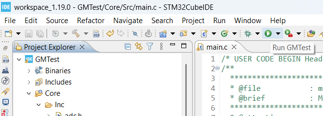

# IV-POGM

The IV-POGM (Intravenous Perioperative Glucose Monitor) system is developed by MSDII Team 24271. The device is capable of continuously monitoring glucose levels of a patient during surgery. During initial setup, the allotted ranges before alerting hypoglycemia or hypoglycemia. Glucose measurements are taken on a set sampling frequency and displayed to the user. If values exceed the set range, visual and audio alerts will be made. Once the measuring session is complete, a log of data will be exported from the device.

## Usage

With the project open in STM32CubeIDE, clicking the run button will flash the project to the microprocessor. An STLINK-V3MINIE was used to connect a PC to the PCB. 

All peripheral files (adc, gpio, i2c, etc.) were generated by the CubeIDE after configuration in the .ioc file. System functionality is defined and implemented in main.c. All user-made files associated with the LCD display (ILI9341_STM32, GFX_STM32, cd_driver, lcd_ui) will need to be heavily debugged / redone. Attempts to utilize this section of the code were unsuccessful.

## Acknowledgement

The members of Team 24271 (Kingsley Nwabeke, Aries Ho, Austin Smith, Shane Guasteferro, Amber Flynn, and Alex Merkel) deserve special thanks for their contributions to the planning, development, and execution of this project.

## License

IP Registrastion is pending with Cheryl Ernst